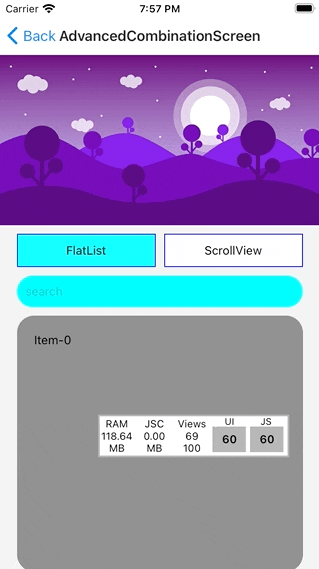

# @r0b0t3d/react-native-collapsible

Fully customizable collapsible views


## Installation

```sh
yarn add @r0b0t3d/react-native-collapsible
```

## Usage

```js
import {
    CollapsibleFlatList,
    CollapsibleScrollView,
} from '@r0b0t3d/react-native-collapsible';

// ...
const MyComponent = () => {
    const { 
        collapse,   // <-- Collapse header
        expand,     // <-- Expand header
        scrollY,    // <-- Animated scroll position. In case you need to do some animation in your header or somewhere else
    } = useCollapsibleContext();

    return (
        <View>
            <CollapsibleHeaderContainer>
                <!-- Your header view -->
            </CollapsibleHeaderContainer>
            <CollapsibleFlatList
                data={data}
                renderItem={renderItem}
                persistHeaderHeight={55}
            />
        </View>
    )
}

export default withCollapsibleContext(MyComponent); // <-- wrap your component with `withCollapsibleContext`
```

## Contributing

See the [contributing guide](CONTRIBUTING.md) to learn how to contribute to the repository and the development workflow.

## License

MIT
